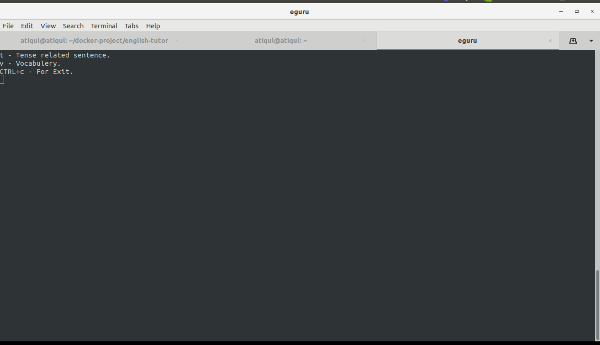
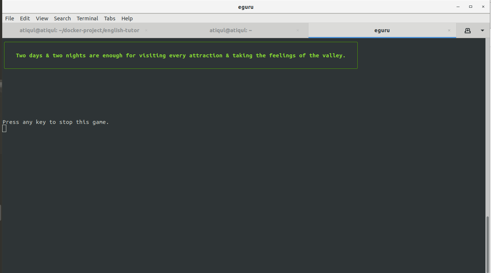

# english-tutor

This script provide you random sentense you just need to convert present tesnse to past tense.

How you install it?

Just donwnload it, then go to the root folder and type

npm install -g .

After that just type : eguru

    </img> 

Then just type : t

    </img> 

